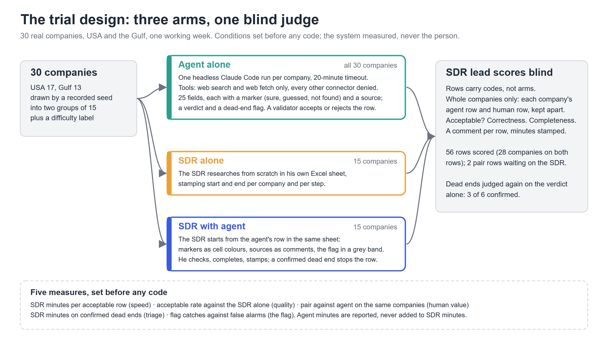
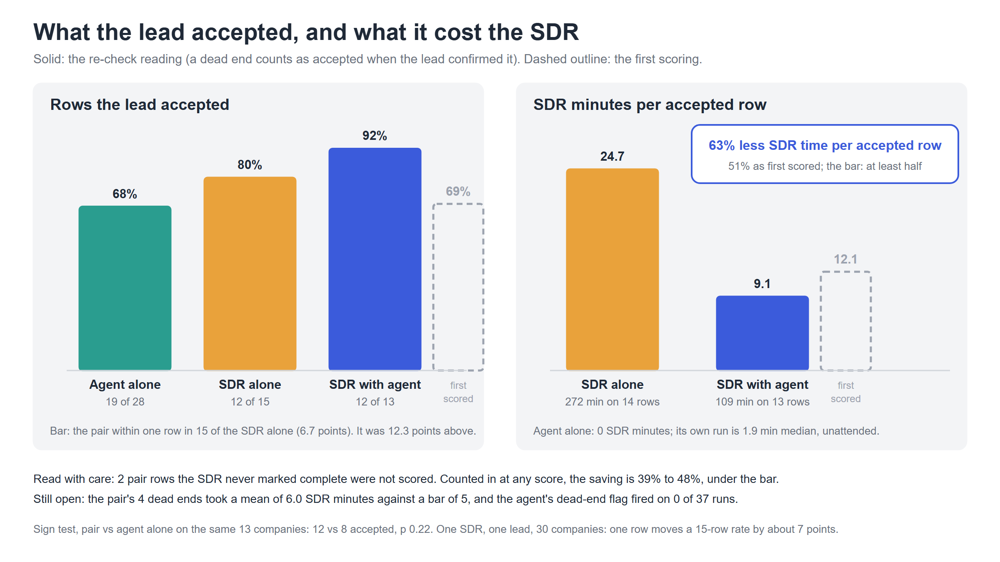
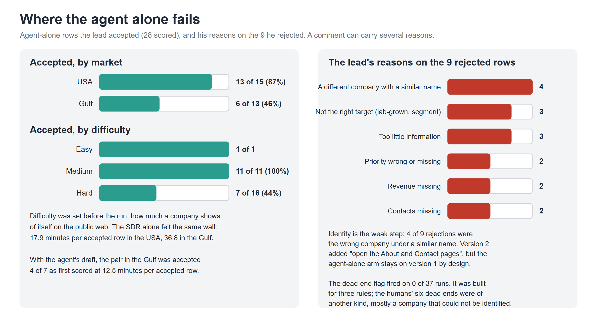

# I put an AI research agent next to our SDR for a week. Here is what we measured.

## Summary

Our pre-sales SDR (sales development rep: the person who finds and researches new companies
before the first contact) works in B2B diamonds. He spends two days a week researching
companies across Google, Apollo, RapNet, trade sources and our CRM, because no single tool
tells you whether a company is a diamond buyer. I built a research agent on Claude Code that
drafts the full research record from public web pages, then measured it on 30 real companies
in the USA and the Gulf in three ways: the SDR alone, the agent alone, and the SDR checking
and completing the agent's draft. Our SDR lead scored 56 records without knowing which way
each was made. The pair won: the SDR's time per accepted record fell from 24.7 to 9.1
minutes, and the lead accepted 92 percent of the pair's records against 80 percent of the
SDR's own and 68 percent of the agent's. The "likely dead end" flag, the one feature I was
counting on, never fired in 37 runs.

## Problem and insight

The SDR is on my team, with about five years in the diamond trade. For every company he opens
Google, then Apollo, then RapNet, then IDEX or another trade source, finds the website and
location, checks our CRM to see whether we already deal with them, then reads the website and
trade pages to fill about 25 fields: what they sell by category (gold, natural diamonds,
lab-grown diamonds, gemstones, pearls, watches, jewellery), turnover, type of customer,
countries and cities, contacts with email and phone, and a short write-up. One company's
fields together are what we call a row.

Every row ends in two decisions, and they are the point of the whole exercise. The verdict:
prospect, or dead end, meaning not worth contacting because it is a competitor, an account we
already have, the wrong kind of business or the wrong segment. And the priority, from AAA
down to E, which decides who gets called first. Ten to fifteen minutes a row, about 96
companies in his two days.

Why not just use Apollo or Clay? In a data-rich trade like software they hold nearly
everything. In diamonds they do not: many targets are small family firms with a thin web
presence and contacts reached through the trade, and the verdict is a trade judgment, not a
database field. Does this jeweller buy natural diamonds, or only lab-grown? Is it part of a
competitor group? Is it already our account under another name? That sits across four or
more sources and our CRM, and no tool stitches it together.

The waste is in the dead ends. A competitor or an existing account gets the same fifteen
minutes as a real prospect, and the disqualifying fact shows up at the end. Research eats
the days meant for calling.

How I got here: the Collaborative Intelligence brief asks you to measure real people at
work. I scored ten tasks across our departments on its criteria, and lead research won. A
week of discovery with the SDR and his lead fixed the problem, its causes and five
pass-or-fail conditions before any code.

## Solution overview

- **The agent** researches one company per run and writes the full row: every field with a
  marker (sure, guessed, not found) and its source, the verdict with its reason, the
  priority, and a "likely dead end" flag when a dead-end rule is met.
- **The SDR alone** researches 15 companies from scratch, as today, noting the start and end
  time of each step.
- **The SDR with the agent** gets the agent's row inside his own Excel sheet for the other
  15: markers as cell colours, sources as cell comments, the flag in a grey band. He checks
  it, fills what is missing, and gives the final verdict and priority. Every company also
  has an agent-alone row, so all 30 are scored both ways.
- **The SDR lead** scores every finished row by a code, without knowing who made it: would
  you let the SDR call from this row? How many key facts are wrong? How complete is it? Plus
  a comment and the time he spent.
- **I** picked the 30 companies by a recorded random draw, balanced by market and by how hard
  they are to research, built every file the two of them worked in, and ran the agent.

What I used. Claude Code, run without a chat window, one company per run, on the Opus 5.5
model. The agent was allowed exactly two things, web search and reading web pages; nothing
else could be called, and I tested that. Its instructions were locked before the run, so
every company got the same agent. A small Python check rejects any row that misses a field,
has a wrong marker, or raises a flag without a source. The Excel files and the results were
built with Python; files went by email, one a day. Every build step was logged as it
happened, and before anything went public a script checked that no email, phone number or
CRM status was left in.

*Figure 1. Three ways of working, one judge who did not know which was which.*

## Build journey

About three weeks, starting mid-September.

- Week one was discovery with the SDR and his lead: how the research is really done, where
  the time goes, what a good row looks like. Their answers became the row format both the
  human and the agent fill, with the priority scale and the four dead-end kinds, the SDR's
  Excel workbook, the lead's scoring questions, and the five conditions the trial had to
  pass.
- What they told me before any build: the lead put research at ten to fifteen minutes a
  company, 80 to 85 percent right on the first pass, and two to five minutes for him to score
  a row; the SDRs, paid on sales, feel research as time with no value for them. Nobody had
  ever timed it. The measured median came out at 15 minutes a company, but the range ran
  from 1 to 44, and per accepted row it was 24.7.
- Week two was the build. Four days went to tooling, and I switched the model once before
  locking the agent. Two companies outside the 30 were the smoke tests, and a lock test
  proved the agent could reach no other tool.
- On batch night our shared Apollo account had 30 credits left of 2,500, spent elsewhere, so
  the agent ran on the web alone: 30 of 30 rows valid in 67 minutes, zero credits. Contacts
  paid the price: an email on 5 of 28 agent rows against 10 of 15 SDR rows.
- Week three was the trial. The SDR worked one file a day and sent it back; the next file
  was built on his return, and he finished all 30 companies a day early.
- The SDR's returns were my best feedback. His first file came back with companies stamped
  in blocks, "Not Sure" typed in yes/no cells, and a dead end called "not much information
  online", so the next file carried four printed rules: stamp each company on its own, leave
  a cell blank when unsure, a dead end needs one of the four kinds, and do not touch the grey
  columns. His checks of the first eight agent rows moved 32 cells; 84 percent stood. He wrote
  the group's head office where the agent had written the store's market, and he wanted the
  company's main phone number even when no contact was named. Those two, plus pages the
  agent had read but not used and pages it had not opened, became four fixes to the agent's
  instructions. The fixed agent ran on the last 7 pair companies; the first 8 had the agent
  as first built.
- The lead's feedback came through his sheet. He had not opened the first scoring file by
  the time the second was ready, so he got one consolidated file with the scoring steps, the
  comment rule and a do-not-edit line printed on it, and scored all 56 rows in two sittings,
  about a minute each. His comments on the six dead-end rows, that there was nothing there
  to call from, were what showed me my question was wrong.
- My scoring sheet had asked "would you let the SDR call from this row?", a question a
  correct dead end can only fail, and he had marked all six No. I sent the six back with the
  question I meant, "is this dead end right?", and he confirmed three. The main numbers below
  use that second reading; the first is shown beside it.

## Results and metrics

| Way of working | Rows scored | Accepted by the lead | SDR minutes per accepted row | Agent minutes per row |
|---|---|---|---|---|
| Agent alone | 28 | 19 (68%) | 0 | 1.9 |
| SDR alone | 15 | 12 (80%) | 24.7 | 0 |
| Pair: the agent researches, the SDR checks and completes | 13 | 12 (92%) | 9.1 | 2.2 |
| Pair, agent as first built (first 7 companies) | 7 | 7 (100%) | 10.0 | |
| Pair, agent after the four fixes (last 6 companies) | 6 | 5 (83%) | 7.8 | |
| Pair, as first scored, before the dead-end re-check | 13 | 9 (69%) | 12.1 | |

Why the row counts differ: the agent researched all 30 companies, the SDR did 15 alone and
15 with the agent. Two pair rows were never marked complete, so those two companies, and
their agent rows, were not scored: 28 agent rows, 15 SDR rows, 13 pair rows.

*Figure 2. Solid bars: after the re-check. Dashed outline: the first scoring.*

- **The pair won:** fastest per accepted row and the highest acceptance. The agent alone is
  the cheapest and good on easy and medium USA companies, but 68 percent overall. The SDR
  alone is accurate and the slowest.
- **Speed held.** 63 percent less SDR time per accepted row (51 on the first scoring). If
  the two unfinished pair rows are counted in at any score, the saving is 39 to 48 percent,
  under my bar of half.
- **Quality held after the re-check.** 92 percent against 80, where I had allowed one row in
  fifteen below. On the first scoring it failed, 69 against 80.
- **The human still adds value.** On the same 13 companies the pair had 12 accepted rows
  against the agent's 8. At 13 companies that gap could still be chance.
- **Priority and verdict, the two decision fields.** The agent set a priority on all 28 of
  its rows and the lead questioned 8; the SDR set it on 12 of 15 and the lead questioned 4.
  The humans called six companies dead ends, two by the SDR alone and four by the pair; the
  lead confirmed three. The agent called none. Those four pair dead ends took 6.0 SDR
  minutes on average against my bar of 5, so dead ends still cost too much.
- **The flag never fired.** It fires on positive evidence of three rules: a competitor group,
  a lab-grown-only seller in the Gulf, a business that does not buy diamonds. The six dead
  ends were mostly companies nobody could identify, and "could not identify" was never a
  flag condition. On those six the lead sided three times with the agent and three with the
  human.
- **Where the agent falls down.** USA 13 of 15 rows accepted, Gulf 6 of 13; medium
  companies 11 of 11, hard 7 of 16. The lead's reasons on the nine rejected rows: a
  similar-named company 4 times, wrong target 3, too little information 3.
- **How accuracy was checked.** Every agent cell carries a marker and a source, so it can be
  checked. The Python check rejected badly formed rows. The lead's scores, given without
  knowing the arm, are the accuracy measure, every headline number was recomputed a second
  way, and the six dead ends were judged twice.
- **Read the numbers with care.** One person scored all the rows, about a minute each. With
  15 rows per arm, one row changes a percentage by about 7 points, so small gaps between
  arms do not mean much.

*Figure 3. The agent alone by market and by difficulty, and why the lead rejected nine rows.*

## Conclusion

For a trade where the tools stop short, the pair is the way to do this work. The agent
drafts a row in two minutes for about 1.4 dollars, and the SDR checks it in nine minutes per
accepted row instead of twenty-five, with quality held. The agent alone is not good enough,
especially in the Gulf and on hard companies, and the SDR alone cannot be made faster. Dead
ends still cost six minutes and the flag needs a redesign, so the next step is the SDR's
real weekly list with the CRM check built in.

## Learnings and next steps

- Nobody had measured research time in eighteen months; it had only been felt. The baseline
  alone was worth the trial.
- Build for the gap the tools leave. Apollo and Clay are right where they cover the trade; in
  diamonds the row is decided by trade judgment across sources, and that is where the SDR
  and the agent together beat either alone.
- Define every field before two people fill it: eight of the first 32 edits were two honest
  readings of one undefined field.
- Ask the judge the question you mean. One line on the scoring sheet flipped the quality
  result and meant a re-check in the middle of the night.
- "Could not identify" needs its own flag. Four of the six dead ends were companies the agent
  could not pin down; it said so in words and the flag stayed off. Next: flag it, and check
  our CRM, where "existing account under another name" lives.
- What surprised me most was not the time saving, which I expected. It was how much the
  result hung on one line of a scoring sheet, and that the feature I was counting on never
  fired once.
- Next: licensed contacts, the identity flag with the CRM lookup, a second SDR and a second
  scorer to see if the 63 percent holds, and a separate research path for the Gulf, where
  both the agent and the SDR struggled.

## Team and roles

Solo capstone: discovery, measurement design, the build with Claude Code as my pair
programmer, the file exchange and this write-up. Our SDR was the worker and our SDR lead the
judge; we measured the system, never the people, and both stay unnamed on purpose.

## Resources and inspirations

100xEngineers and the Collaborative Intelligence brief; Claude Code and Opus 5.5; our SDR and
SDR lead, who gave me their time in a working week. If you run a sales team in a fragmented
trade and want to try the same test, the repository has everything except our company list.
Happy to compare notes.

- Repository (code, prompts, logs, rows, results): https://github.com/skulllzzz-ai/SDR-Research-Agent
- Live page: https://skulllzzz-ai.github.io/SDR-Research-Agent/
- Demo video: linked from the repository README.

@100xEngineers #0to100xEngineer
